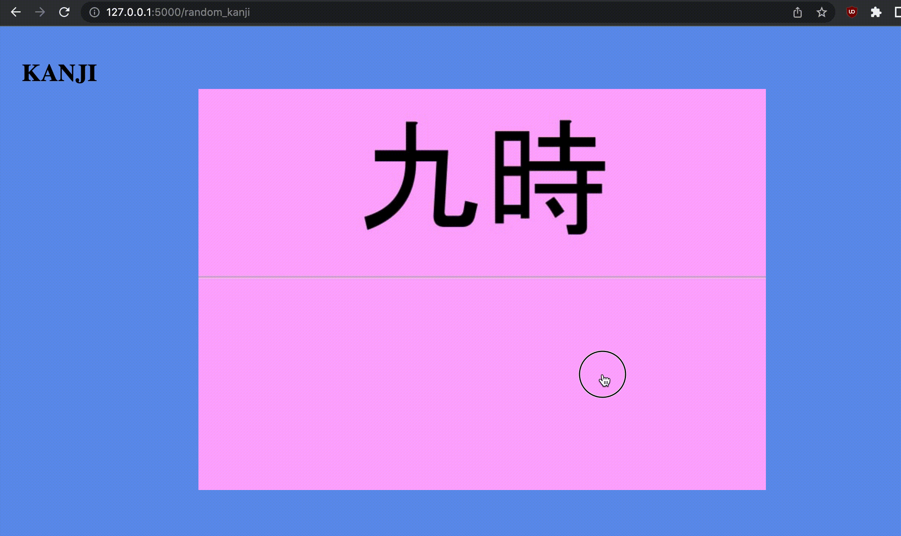

# pyanki
anki as python service

work in progress 🚧 🚧 🚧

put images of the following format into the "kanji" directory:

the upper part is the kanji you are learning, and the 
lower part is whatever helps you to understand it's meaning

and here is a small demo

